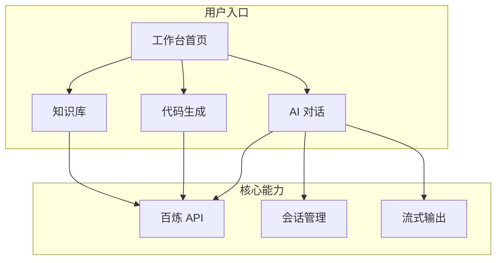

# Zerone 项目设计参考

## 一、项目定位与核心价值

**Zerone**（从 0 到 1）：用自然语言描述愿景 → AI 生成/执行 → 快速迭代，开发者接受代码而不必完全理解细节，实现从 0 到 1 的创造闭环。

**面试亮点**：体现你对 AI 辅助开发趋势的理解、全栈能力、模块化架构设计，以及「用 AI 做 AI 产品」的闭环。

---

## 二、你已有的模块（AI 机器人对话）

- **技术实现**：Vue3 + Vite + TS 前端 + 阿里云百炼 API（DashScope）
- **百炼接入**：支持 OpenAI 兼容调用、流式输出、多轮对话
- **建议形态**：聊天界面 + 流式打字效果 + 会话管理（新建/切换/历史）

---

## 三、可增加的模块建议

| 模块                | 与 Zerone 的关联                           | 技术复杂度 | 面试价值                       |
| ----------------- | -------------------------------------- | ----- | -------------------------- |
| **自然语言生成代码**      | 用户用自然语言描述「想要的功能」，AI 返回可运行代码            | 中     | 高，直接体现 Zerone 从 0 到 1 核心理念 |
| **代码执行沙箱**        | 在浏览器内安全执行 AI 生成的代码（如 iframe + sandbox） | 中     | 高，展示对安全边界的思考               |
| **代码预览/编辑**       | 展示 AI 生成的代码，支持一键复制、简单编辑                | 低     | 中                          |
| **知识库/RAG**       | 上传文档，AI 基于文档回答，模拟「专属助手」                | 中     | 高，展示 RAG 理解                |
| **Prompt 模板/工作流** | 预设「写一个 Vue 组件」「解释这段代码」等 prompt 模板      | 低     | 中                          |
| **会话导出/分享**       | 导出对话为 Markdown、分享链接                    | 低     | 中                          |
| **多模型切换**         | 预留接入其他模型（如通义千问不同版本）的扩展点                | 低     | 中                          |

**推荐优先实现**（面试够用且体量可控）：

- 1）AI 对话（已有）
- 2）自然语言生成代码 + 代码预览
- 3）知识库/RAG（可选，若时间紧可做简化版）

---

## 四、你可能未考虑到的设计点

### 4.1 产品与体验

- **流式体验**：百炼支持流式输出，前端需做逐字渲染、中断重试、错误降级
- **上下文长度**：长对话会超出上下文，需设计「总结 / 压缩」或分段策略
- **多轮 vs 单轮**：是否支持「继续上文」、引用历史消息，会直接影响接口与状态设计
- **敏感信息**：API Key 是前端存还是后端代理？后者更安全，但需要简单的 Node 中间层
- **空态与错误态**：
  - 空会话：引导文案「输入消息开始对话」或「描述你想实现的功能」
  - 加载态：流式生成时展示打字光标或轻微动画，避免空白等待
  - 错误提示：友好文案（如「网络异常，请重试」），提供重试按钮
- **响应式与可访问性**：移动端适配（会话列表可折叠）、键盘导航（Tab 聚焦、Enter 发送）、焦点顺序合理、色彩对比符合 WCAG

### 4.2 技术架构

- **前后端分离**：API Key 不能直接暴露在前端，建议用 BFF/中间层转发百炼请求
- **状态管理**：会话列表、当前对话、生成中的状态，用 Pinia 或 Composition API 管理
- **错误处理**：API 限流、超时、网络错误、模型异常的统一处理与用户提示
- **类型安全**：百炼返回结构需定义 TS 类型，便于后续扩展

### 4.3 安全与合规

- **输入校验**：对用户输入做长度、敏感词、XSS 等基础校验
- **输出过滤**：AI 生成代码时，需防范执行危险代码（eval、网络请求等）
- **隐私**：对话是否持久化、是否加密、是否合规（如涉个人隐私）

### 4.4 扩展与工程化

- **模块解耦**：对话、代码生成、知识库等按功能拆成独立模块，便于后续增加模块
- **配置化**：模型名、API 地址、上下文长度等可配置，方便切换环境
- **可测试性**：API 调用层抽象，便于 mock 做单元/集成测试

### 4.5 原型与展示

- **低保真 vs 高保真**：面试项目可先做低保真，重点展示核心流程与架构
- **Demo 故事线**：
  1. 首页 → 展示 Zerone 定位与两个模块入口
  2. 点击「AI 对话」→ 输入「写一个 Vue 3 计数器组件」→ 展示流式回复
  3. 点击「代码生成」→ 输入需求 → 流式生成代码 → 预览/复制
  4. 强调：从 0 到 1（自然语言 → 可运行代码）的完整闭环
- **技术选型说明**：能说清为何用 Vue3、Pinia、Vite 等，以及和 Zerone 从 0 到 1 理念的契合点

---

## 五、信息架构草图（参考）

---

## 六、UI 设计原则（原研哉美学落地）

- **留白与虚空**：大面积留白，信息密度低，聚焦当前任务；主背景浅白/米白
- **减法**：去掉非必要元素，仅保留核心操作与内容；无渐变、阴影、复杂边框
- **触知**：按钮、输入框有清晰的 hover/focus 反馈，传递「可触碰」的暗示
- **情感传达**：「从 0 到 1」通过留白与简约传达创造感，而非科技感堆砌
- 详见 [.cursor/docs/design/UI设计规范-原研哉美学.md](.cursor/docs/design/UI设计规范-原研哉美学.md)

---

## 七、下一步

当你认为方向合适、需要落地时，可以说：

> **「请帮我总结内容并输出阶段原型」**

届时将输出：

- 阶段一产品原型（功能清单、页面结构、关键交互）
- 技术架构与目录结构建议
- 实现优先级与迭代节奏

---

---

## 附录：与实现对照

| 001 设计点 | 对应实现 |
|------------|----------|
| 工作台首页 | `src/views/HomeView.vue` |
| AI 对话 | `src/views/ChatView.vue`、`src/stores/chat.ts` |
| 代码生成 | `src/views/CodegenView.vue`（待实现） |
| BFF 代理 | `server/index.js` |
| 路由 | `src/router/index.ts` |

*说明：本文档为设计参考，不执行任何代码修改。*