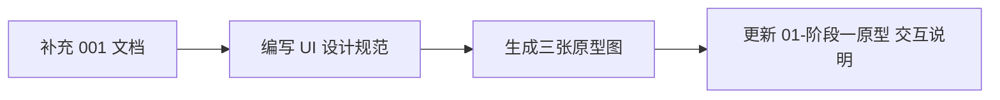

# 001 补充与原型图设计计划

## 一、001 文件浏览与补充

### 1.1 当前 001 内容概览

[.cursor/plans/001.md](.cursor/plans/001.md) 已覆盖：项目定位、已有模块、可扩展模块建议、设计考量（产品/技术/安全/扩展/原型）、信息架构图。

### 1.2 建议补充内容

| 补充项          | 补充位置          | 内容要点                                      |
| ------------ | ------------- | ----------------------------------------- |
| **UI 设计指导**  | 新增「七、UI 设计原则」 | 原研哉审美落地：留白、虚空、减法、触知感                      |
| **空态与错误态**   | 4.1 产品与体验     | 空会话引导、加载骨架、错误提示文案、重试机制                    |
| **响应式与可访问性** | 4.1 或新增小节     | 移动端适配、键盘导航、焦点顺序、色盲友好                      |
| **实现状态对照**   | 新增「附录：与实现对照」  | 现有代码（HomeView/ChatView 等）与 001 的对应关系，便于追踪 |
| **Demo 故事线** | 4.5 原型与展示     | 具体 Demo 脚本：首页 → 选模块 → 完成一次对话/生成代码 → 展示关键点 |

---

## 二、原研哉审美在 Zerone 的落地

### 2.1 核心原则映射

| 原研哉理念   | Zerone 落地                           |
| ------- | ----------------------------------- |
| 虚空 / 留白 | 大面积留白，信息密度低，聚焦当前任务                  |
| 白       | 主背景为浅白/米白，避免纯黑背景；强调「空」的包容性          |
| 减法      | 去掉非必要元素，仅保留核心操作与内容                  |
| 触知      | 按钮、输入框有清晰的 hover/focus 反馈，有「可触碰」的暗示 |
| 情感传达    | 「从 0 到 1」通过留白与简约传达创造感，而非科技感堆砌       |

### 2.2 设计规范摘要

- **色彩**：主色白/米白，辅助灰（#f5f5f5、#e8e8e8），强调色极克制（如单一蓝或灰蓝）
- **字体**：无衬线，字重以 regular/medium 为主，字号层级少（3–4 级）
- **间距**：模块间留白大，行高、字距适中
- **装饰**：无渐变、阴影、复杂边框；线条细、颜色淡

---

## 三、原型图产出形式与内容

### 3.1 产出物

1. **设计规范文档**：`[.cursor/docs/design/UI设计规范-原研哉美学.md](.cursor/docs/design/UI设计规范-原研哉美学.md)` —— 色彩、字体、间距、组件风格
2. **页面原型图**：使用 `GenerateImage` 工具生成 3 张低保真线框图 / 高保真 mockup
3. **交互说明**：在 [.cursor/docs/prototype/01-阶段一原型.md](.cursor/docs/prototype/01-阶段一原型.md) 中补充各页面的交互流程与关键状态

### 3.2 三张原型图规格

| 页面         | 规格说明                      | 关键元素                                    |
| ---------- | ------------------------- | --------------------------------------- |
| **工作台首页**  | 浅色背景，大量留白，居中模块入口          | 标题 Zerone、副标题、2 个卡片（AI 对话 / 代码生成），无多余装饰 |
| **AI 对话页** | 左侧窄边栏（会话列表）+ 主区（消息 + 输入框） | 消息气泡极简、输入框简洁、会话列表克制                     |
| **代码生成页**  | 上输入区 + 下代码预览区             | 需求输入框、流式代码展示区、复制按钮，留白充足                 |

### 3.3 原研哉风格视觉描述（供图片生成）

- 背景：米白或浅灰 (#fafafa、#f5f5f0)，避免纯白刺眼
- 文字：深灰 (#333)，无粗体堆砌
- 卡片/容器：细线边框 (#e0e0e0)，无阴影或极浅投影
- 留白：模块上下左右留白大于内容区，整体偏「空」
- 无图标滥用，无渐变、无高饱和色

---

## 四、执行顺序与依赖

1. 先补充 001：UI 设计指导、空态/错误态、响应式、Demo 故事线
2. 新建 UI 设计规范文档（含原研哉落地原则与具体数值）
3. 根据规范生成三张原型图
4. 在 01-阶段一原型 中补充各页的交互流程与状态说明

---

## 五、文件变更清单

| 文件                                           | 操作                                                   |
| -------------------------------------------- | ---------------------------------------------------- |
| [.cursor/plans/001.md](.cursor/plans/001.md) | 编辑：补充 1.2 中列出的内容                                     |
| `.cursor/docs/design/UI设计规范-原研哉美学.md`        | 新建                                                   |
| `.cursor/docs/prototype/01-阶段一原型.md`         | 编辑：补充交互流程与关键状态                                       |
| 三张原型图                                        | 新建（存放于 `.cursor/docs/prototype/assets/` 或项目 docs 目录） |

