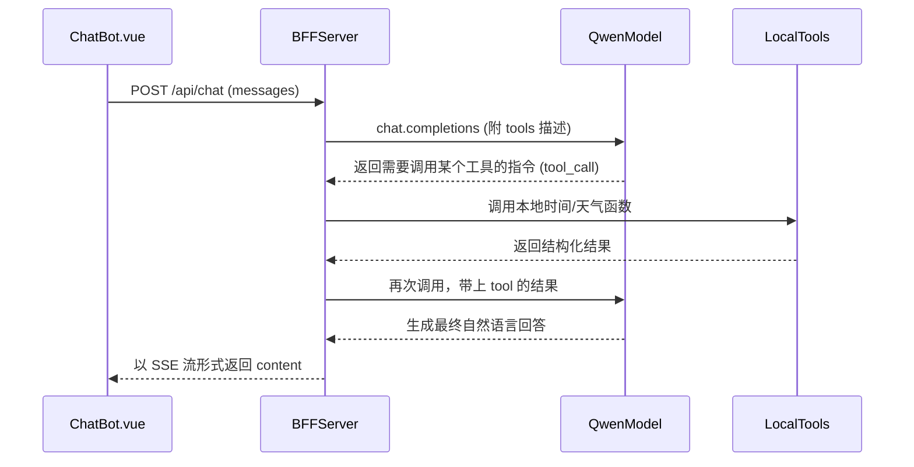

## 总体目标

在当前使用 DashScope OpenAI 兼容接口的 `server/index.js` 基础上：

- 继续复用 `/api/chat` 这一个入口
- 为千问增加“工具调用”能力：当用户问时间或天气时，模型可以触发我们定义的工具（例如当前时间、查询某地天气），BFF 实际执行工具逻辑并把结果回填给模型，再把最终自然语言回答流式返回给前端。
- 先不接入真实天气服务，按可扩展设计预留对接第三方天气 API 的位置。

## 现状梳理

- `server/index.js` 当前逻辑：
  - 读取 `.env` 中的 `DASHSCOPE_API_KEY`
  - 使用 `OpenAI` SDK，`baseURL` 指向 `https://dashscope.aliyuncs.com/compatible-mode/v1`
  - 调用 `openai.chat.completions.create({ model: 'qwen-plus', messages, stream: true })`
  - 直接将 `choices[0].delta.content` 流式转成 SSE 推给前端（`data: { content }`）。
- 前端聊天模块通过 `@@/apis/chat.ts` 的 `fetchChatStream` 消费这个 SSE 流，对 UI 来说只关心 `{ content }`。

## 设计思路

### 1. 工具调用交互流程（概念）

使用 Qwen 的 function-calling 能力时，通常流程是：

在 OpenAI 兼容接口下，这些信息体现在：

- 请求中多了 `tools` 和（视情况）`tool_choice` 字段
- 返回的 `choices[0].delta.tool_calls` / `choices[0].message.tool_calls` 用来描述模型希望调用哪个工具、输入是什么

### 2. 需要新增的“工具”定义

在 `server/index.js` 里定义两类工具（后续扩展可新增）：

- **当前时间工具 `get_current_time`**
  - 入参：可选的时区/地区标识（例如 IANA timezone 字符串）
  - 出参：标准化的时间字符串（例如 ISO8601）以及人类可读的本地时间描述
- **天气工具 `get_weather`**（先做 mock）
  - 入参：`location`（城市名，必要）、可选 `unit`（C/F）
  - 出参：包含温度、天气概况、数据时间戳的对象；目前返回一份模拟数据，并在内部注释/结构预留未来对接真实天气 API 的位置。

这些工具通过一个 JSON Schema 结构放到 `tools` 列表中传入 Qwen，让模型知道能调用哪些函数，以及参数结构。

### 3. BFF 内部调用流程调整

在 `server/index.js` 中，将当前简单的单次流式调用调整为两阶段逻辑（但对前端保持接口不变）：

- **阶段 A：携带 tools 发起首次调用**
  - 传入现有 `messages`，再追加一个 system 提示，告诉模型：
    - 它可以通过工具获取“当前时间”和“某地天气”
    - 当用户明确询问这些信息时，优先调用工具而不是凭空编造
  - 设置 `tools`（描述 `get_current_time` / `get_weather`），`stream` 可以先保持 `false`，以便完整拿到工具调用结构；等第二阶段再考虑是否使用流式。
- **阶段 B：根据模型返回决定下一步**
  - 若模型直接给出了自然语言回答（没有工具调用），则：
    - 将该回答再包装成我们现有的 SSE 流格式推给前端（按行拆分或一次性推送）。
  - 若模型返回 `tool_calls`：
    - 解析需要调用的工具名称与参数
    - 调用对应 Node 函数（例如 `callGetCurrentTime`, `callGetWeather`）
    - 将工具结果以 role=`tool` 的消息形式附加到上下文 messages 中
    - 再次调用 Qwen（第二次 `chat.completions`），让模型根据工具返回结果输出最终自然语言回答
    - 把这次的自然语言回答用现有 SSE 流方式返回给前端

> 说明：第一版可以不做“全链路流式工具调用”，而是采用 **非流式工具调用 + 流式最终回答** 的折中方案，简化实现复杂度。

### 4. server/index.js 拆分与封装

为保持代码清晰，可在 `server/index.js` 中做如下职责划分：

- **配置与客户端创建**
  - 抽出一个 `createDashScopeClient()` 函数，返回配置好的 `openai` 实例。
- **工具定义与分发**
  - 定义一个 `tools` 数组（供 Qwen 识别）
  - 定义一个 `executeToolCall(toolCall)` 函数，内部 `switch` / 映射 name 调到具体实现。
- **高层对话处理函数**
  - `handleChatWithTools(messages)`：封装完整的 A/B 阶段逻辑，对外暴露一个
    - 入参：前端传来的 `messages`
    - 出参：最终自然语言回答字符串（或可选流式生成器，为后续扩展预留）
- **Express 路由层**
  - 在 `app.post('/api/chat', ...)` 中只保留：
    - 参数校验
    - 调用 `handleChatWithTools`
    - 负责把返回的回答转成 SSE 流发送给前端

这样以后如果要接入真实天气服务，只需要改 `executeToolCall('get_weather')` 的实现，不影响路由层和前端。

### 5. 天气数据的扩展预留

虽然本次暂时不接真实天气 API，但可以在工具实现中预留结构和 TODO：

- 在 `get_weather` 的实现中：
  - 定义清晰的返回结构：
    - `temperature`
    - `unit`
    - `condition`（如 sunny/cloudy）
    - `location`
    - `observed_at`（时间戳）
  - 当前先用固定/伪随机数据返回，保证格式稳定
  - 在注释中标记未来接入点（例如 `// TODO: 调用第三方天气API获取真实数据`），并预设 HTTP 调用方式（axios/fetch）与错误处理策略。

### 6. 错误处理与回退策略

- 若工具执行失败（例如未来调用真实天气 API 时网络错误）：
  - 记录错误日志
  - 返回一个标记失败的工具结果（带错误说明），让模型按“暂时无法获取实时天气”进行回答
- 若 Qwen 返回的工具参数解析失败：
  - 在 BFF 侧做基本防御性判断（字段存在性/类型检查）
  - 回退到“普通对话”：
    - 增加一条 system 消息告诉模型“工具调用失败，请直接根据自身能力回答”，再次发起模型调用。

### 7. 时间与时区处理建议

- 当前时间工具实现建议：
  - 后端以服务器时间为基准，用 `Date` 和 `Intl.DateTimeFormat` 格式化
  - 参数中预留 `timezone`（IANA 字符串）与 `locale` 字段，便于以后拓展
  - 返回同时包含：
    - 一个机器友好的 ISO 字符串（例如 `2026-03-05T12:34:56+08:00`）
    - 一个适合直接展示的本地化字符串（例如 `2026年3月5日 12:34:56 (GMT+8)`）

### 8. 对前端的兼容性

- 当前前端 `fetchChatStream` 只认 `data: { content }` 的 SSE
- 本次改造保持：
  - SSE 格式不变：仍旧是 `data: { content: string }` 多次推送，最后一条 `data: [DONE]`
  - 若工具调用导致等待稍长，可以考虑：
    - 在 BFF 一开始就推送一个简短提示（如“正在查询实时数据...”），作为第一段 `content`
    - 然后再流式推送最终回答（可选）。

## 实施步骤（概要）

1. **梳理并确认 DashScope function-calling 的字段名**（tools/tool_choice 等），确保在 OpenAI 兼容模式下使用方式正确。
2. **在 `server/index.js` 中补充工具描述结构**：定义 `get_current_time` 与 `get_weather` 的 JSON Schema。
3. **实现本地工具函数**：
  - `callGetCurrentTime(params)`：返回标准化时间结构
  - `callGetWeather(params)`：返回 mock 天气结构，并预留真实天气 API 对接点
4. **封装工具执行逻辑**：实现 `executeToolCall(toolCall)`，根据 `toolCall.function.name` 分发到对应函数，返回 JSON 结果。
5. **实现高层对话处理函数**：
  - `handleChatWithTools(messages)` 内：
    - 调用 Qwen 首次生成，检查是否有 tool_calls
    - 如有，调用 `executeToolCall`，构造 tool 消息，再次调用 Qwen
    - 最终返回自然语言回答文本
6. **调整 `/api/chat` 路由**：改为调用 `handleChatWithTools`，并把返回文本按现有 SSE 格式推送给前端，保持前端无感知。
7. **本地测试与验证**：
  - 构造询问当前时间、某城市天气的对话，观察是否触发工具调用，以及模型是否正确利用工具结果生成回答。
  - 验证在普通闲聊问题下行为与原先一致。

## 结束

以上改造可以在不改变前端接口的前提下，为千问增加时间和天气相关的“真实数据”能力，同时通过工具接口设计为未来对接真实天气服务预留扩展空间。