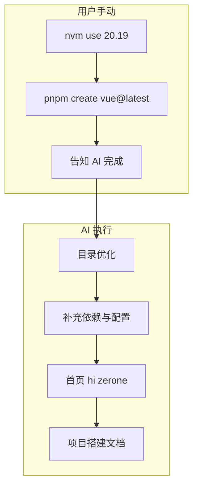

# Vue3 Zerone 项目搭建计划

## 一、目录结构识别与取舍

### 1.1 按 project.mdc 识别出的完整结构

参考 [.cursor/rules/project.mdc](.cursor/rules/project.mdc)：

```sh
# 完整结构（来自 project.mdc）
├─ .husky
├─ .vscode
├─ public (favicon.ico, app-loading.css, detect-ie.js)
├─ src
│  ├─ common (apis, assets, components, composables, constants, utils)
│  ├─ http
│  ├─ layouts
│  ├─ pages (login 等模块)
│  ├─ pinia
│  ├─ plugins
│  ├─ router
│  ├─ App.vue
│  └─ main.ts
├─ tests
├─ types
├─ .editorconfig, .env*, eslint.config.js, tsconfig.json, uno.config.ts, vite.config.ts
```

### 1.2 初建阶段「隐藏」的目录/文件（暂不创建）


| 目录/文件                    | 说明                    |
| ------------------------ | --------------------- |
| `.husky`                 | Git hooks，项目可运行后再加    |
| `.vscode`                | IDE 配置，非构建必需          |
| `tests`                  | 单元测试，暂无用例             |
| `src/pages/login`        | 业务模块，初建仅展示「hi zerone」 |
| `src/layouts`            | 布局组件，首页暂不需要           |
| `src/common/apis`        | 接口层，暂无接口              |
| `src/common/components`  | 通用组件，暂无需求             |
| `src/common/composables` | 组合式函数，暂无需求            |
| `src/http`               | Axios 封装，首页不请求        |
| `uno.config.ts`          | UnoCSS 配置，可延后引入       |
| `.env.staging`           | 预发布环境变量               |


### 1.3 初建阶段需要创建的目录/文件


| 路径                                              | 用途                 |
| ----------------------------------------------- | ------------------ |
| `public/`                                       | 静态资源               |
| `public/favicon.ico`                            | 网站图标（可占位）          |
| `src/main.ts`                                   | 入口                 |
| `src/App.vue`                                   | 根组件，展示「hi zerone」  |
| `src/router/`                                   | 路由（仅首页）            |
| `src/pinia/`                                    | Pinia 占位           |
| `src/plugins/`                                  | 插件（Element Plus）   |
| `src/common/assets/`                            | 静态资源占位             |
| `src/common/constants/`                         | 常量占位               |
| `src/common/utils/`                             | 工具占位               |
| `src/pages/home/index.vue`                      | 首页页面               |
| `index.html`                                    | HTML 入口            |
| `vite.config.ts`                                | Vite 配置（含 @、@@ 别名） |
| `tsconfig.json`                                 | TS 配置              |
| `eslint.config.js`                              | ESLint 配置          |
| `.editorconfig`                                 | 编辑器配置              |
| `.env` / `.env.development` / `.env.production` | 环境变量               |


---

## 二、依赖列表

### 2.1 生产依赖 (dependencies)


| 包名           | 版本   | 用途     |
| ------------ | ---- | ------ |
| vue          | ^3.5 | 框架     |
| vue-router   | ^4   | 路由     |
| pinia        | ^2   | 状态管理   |
| element-plus | ^2   | UI 组件库 |
| axios        | ^1   | 网络请求   |


### 2.2 开发依赖 (devDependencies)


| 包名                 | 版本  | 用途        |
| ------------------ | --- | --------- |
| vite               | ^5  | 构建工具      |
| @vitejs/plugin-vue | ^5  | Vue 插件    |
| typescript         | ^5  | TS        |
| vue-tsc            | ^2  | Vue TS 检查 |
| sass               | ^1  | Scss 预处理器 |
| eslint             | ^9  | 代码检查      |


### 2.3 包管理

- 使用 **pnpm** 安装依赖

---

## 三、搭建步骤

### 3.1 用户手动：create-vue 初始化（第一步）

**由用户在本机终端手动执行**，AI 不自动运行。

1. 切换 Node 版本（避免版本过低导致 pnpm 报错）：

```bash
   nvm use 20.19
   

```

1. 进入项目目录并执行 create-vue：

```bash
   cd zerone
   pnpm create vue@latest .
   

```

   或先在父目录创建临时项目再合并：

```bash
   cd /path/to/apaas-train/2026
   pnpm create vue@latest zerone-temp
   # 交互完成后，将 zerone-temp 内容移入 zerone，保留 .cursor
   

```

1. 交互式选择建议：
  - TypeScript: Yes
  - ESLint: Yes
  - Pinia: Yes
  - Vue Router: Yes
  - Vitest 等可按需跳过
2. **完成后告知 AI**（如说「create-vue 已完成」），AI 再继续执行 3.2～3.4 及文档归纳。

**注意**：若项目内已有手动创建或上次尝试生成的 `package.json`、`src/` 等文件，请先删除或移到备份目录，再执行 create-vue，避免冲突。

### 3.2 AI 执行：目录结构优化（create-vue 完成后）

按 [project.mdc](.cursor/rules/project.mdc) 调整：


| 操作                            | 说明                                                 |
| ----------------------------- | -------------------------------------------------- |
| 新建 `src/common/`              | apis、assets、components、composables、constants、utils |
| 新建 `src/http/`                | Axios 封装占位                                         |
| 新建 `src/layouts/`             | 布局占位                                               |
| 重排 `src/views` -> `src/pages` | 按 project.mdc 使用 pages                             |
| 新建 `src/plugins/`             | Element Plus 等插件                                   |
| 配置 `@@` 别名                    | vite.config、tsconfig 中 `@@` -> `src/common`        |


### 3.3 AI 执行：补充依赖与配置

- 安装 Element Plus、Axios、Sass：`pnpm add element-plus axios`，`pnpm add -D sass`
- 修改 [vite.config.ts](vite.config.ts)：添加 `@@` 别名、Scss
- 修改 [tsconfig.json](tsconfig.json)：`paths` 中 `@@/`*
- 新增 [.editorconfig](.editorconfig)、`.env` 等

### 3.4 AI 执行：首页展示「hi zerone」

- 修改默认首页组件（或 `src/pages/home/index.vue`），居中显示「hi zerone」

---

## 四、文档归纳

在 [.cursor/docs/design/](.cursor/docs/design/) 新增 **项目搭建文档**：

- 文件：`项目搭建文档.md`
- 内容：
  - 技术栈与版本
  - 依赖列表（完整 package.json 片段）
  - 目录结构（含「隐藏」目录说明）
  - 启动命令：`pnpm dev`
  - 构建命令：`pnpm build`

---

## 五、数据流




---

## 六、文件变更清单

### 由 create-vue 生成（无需手写）

- `package.json`、`vite.config.ts`、`tsconfig.json`、`tsconfig.node.json`
- `eslint.config.js`、`index.html`
- `src/main.ts`、`src/App.vue`、`src/env.d.ts`
- `src/router/`、`src/views/`（或 `src/pages/`，依模板）
- `public/`

### 搭建后需新增/修改


| 操作  | 路径                                                          |
| --- | ----------------------------------------------------------- |
| 修改  | `vite.config.ts`（`@@` 别名）、`tsconfig.json`（`@@/*`）           |
| 新建  | `src/common/`、`src/http/`、`src/layouts/`、`src/plugins/`     |
| 调整  | `src/views` -> `src/pages/home`，路由指向首页                      |
| 新建  | `.editorconfig`、`.env`、`.env.development`、`.env.production` |
| 新建  | `.cursor/docs/design/项目搭建文档.md`                             |


